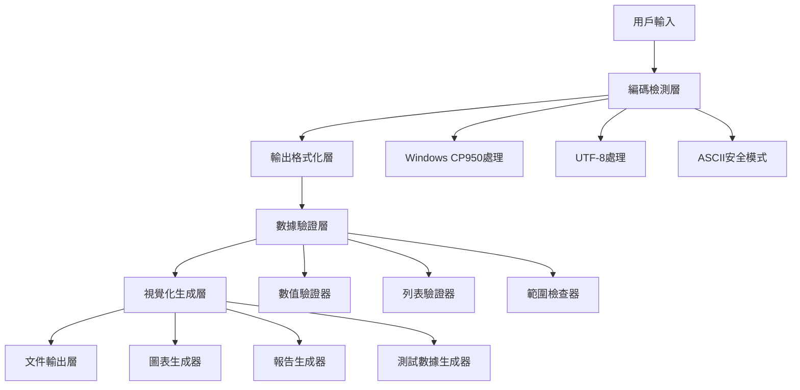

# 設計文件

## 概述

本設計旨在解決RMFS視覺化系統在Windows環境下的相容性問題，主要包括Unicode編碼錯誤、數據驗證不足、以及缺乏適當的錯誤處理機制。系統將採用分層架構，包含編碼處理層、數據驗證層、和視覺化生成層，確保在不同操作系統和編碼環境下都能穩定運行。

## 架構

### 系統架構圖



### 分層設計

1. **編碼處理層 (Encoding Handler Layer)**
   - 自動檢測系統編碼環境
   - 提供Unicode字符的ASCII替代方案
   - 處理Windows cp950編碼限制

2. **數據驗證層 (Data Validation Layer)**
   - 嚴格的數值驗證和清理
   - 異常值檢測和處理
   - 缺失數據的安全預設值

3. **視覺化生成層 (Visualization Layer)**
   - 英文標籤和國際化支援
   - 模組化圖表生成
   - 測試模式支援

4. **錯誤處理層 (Error Handling Layer)**
   - 優雅的錯誤降級
   - 詳細的錯誤報告
   - 自動修復建議

## 組件和介面

### 1. 編碼處理組件 (EncodingHandler)

```python
class EncodingHandler:
    def __init__(self):
        self.system_encoding = self.detect_system_encoding()
        self.safe_mode = self.system_encoding == 'cp950'
    
    def detect_system_encoding(self) -> str
    def safe_print(self, message: str, fallback: str = None) -> None
    def unicode_to_ascii(self, text: str) -> str
    def format_emoji(self, emoji_code: str) -> str
```

**主要功能：**
- 自動檢測系統編碼（cp950, utf-8, ascii）
- 提供安全的輸出函數，自動處理編碼問題
- Unicode表情符號到ASCII的映射
- 條件式格式化輸出

**ASCII替代映射：**
- 📁 → [DIR] 或 "Directory:"
- ✅ → [OK] 或 "Success:"
- ❌ → [ERROR] 或 "Error:"
- 🔍 → [SCAN] 或 "Scanning:"
- 📊 → [CHART] 或 "Chart:"
- ⚠️ → [WARN] 或 "Warning:"
- 💡 → [TIP] 或 "Tip:"

### 2. 強化數據驗證器 (RobustDataValidator)

```python
class RobustDataValidator:
    @staticmethod
    def validate_numeric(value, min_val=None, max_val=None, default=0) -> float
    @staticmethod
    def validate_list(data, expected_length=None, default_item=0) -> List[float]
    @staticmethod
    def safe_get(data, keys, default=None) -> Any
    @staticmethod
    def detect_outliers(data: List[float], threshold: float = 3.0) -> List[bool]
    @staticmethod
    def clean_training_data(raw_data: Dict) -> Dict
```

**驗證規則：**
- NaN/Inf值檢測和替換
- 數值範圍驗證（防止極端異常值）
- 列表長度一致性檢查
- 嵌套字典安全訪問
- 統計異常值檢測（Z-score方法）

### 3. 視覺化管理器 (VisualizationManager)

```python
class VisualizationManager:
    def __init__(self, encoding_handler: EncodingHandler):
        self.encoder = encoding_handler
        self.validator = RobustDataValidator()
    
    def create_training_curves(self, data: Dict) -> List[Path]
    def create_comparison_charts(self, data: Dict) -> List[Path]
    def generate_summary_report(self, data: Dict) -> Path
    def run_test_mode(self) -> Dict
```

**圖表類型：**
- NERL適應度進化曲線
- 完成率比較圖
- 能源效率分析
- 機器人利用率統計
- 綜合性能摘要

### 4. Windows測試管理器 (WindowsTestManager)

```python
class WindowsTestManager:
    def __init__(self):
        self.encoding_handler = EncodingHandler()
        self.dependency_checker = DependencyChecker()
    
    def check_dependencies(self) -> bool
    def run_visualization_test(self, use_test_data: bool = False) -> bool
    def show_interactive_menu(self) -> None
    def open_results_folder(self) -> None
```

## 數據模型

### 訓練結果數據模型

```python
@dataclass
class TrainingResult:
    controller_type: str  # 'nerl', 'dqn', 'traditional'
    reward_mode: str      # 'global', 'step', 'queue', 'time'
    completed_orders: int
    completion_rate: float  # 0.0 - 1.0
    energy_per_order: float
    avg_wait_time: float
    robot_utilization: float  # 0.0 - 1.0
    best_fitness: float
    run_name: str
    metadata: Dict[str, Any]

@dataclass
class GenerationData:
    generation: int
    best_fitness: float
    all_fitness: List[float]
    metrics: Dict[str, float]
```

### 驗證約束

```python
VALIDATION_CONSTRAINTS = {
    'completed_orders': {'min': 0, 'max': 100, 'default': 0},
    'completion_rate': {'min': 0.0, 'max': 1.0, 'default': 0.0},
    'energy_per_order': {'min': 0.0, 'max': 10000.0, 'default': 0.0},
    'avg_wait_time': {'min': 0.0, 'max': 1000.0, 'default': 0.0},
    'robot_utilization': {'min': 0.0, 'max': 1.0, 'default': 0.0},
    'best_fitness': {'min': -1e6, 'max': 1e6, 'default': 0.0}
}
```

## 錯誤處理

### 錯誤處理策略

1. **編碼錯誤處理**
   - 自動檢測並切換到安全模式
   - 提供ASCII替代輸出
   - 記錄編碼問題但不中斷執行

2. **數據錯誤處理**
   - 無效數據使用預設值替換
   - 記錄數據品質問題
   - 提供數據清理報告

3. **文件錯誤處理**
   - 創建缺失目錄
   - 處理權限問題
   - 提供替代保存路徑

4. **依賴錯誤處理**
   - 自動檢測缺失套件
   - 提供安裝指令
   - 優雅降級功能

### 錯誤分級

```python
class ErrorLevel(Enum):
    INFO = "INFO"      # 資訊性訊息
    WARNING = "WARN"   # 警告，但可繼續
    ERROR = "ERROR"    # 錯誤，功能受限
    CRITICAL = "CRIT"  # 嚴重錯誤，無法繼續

class ErrorHandler:
    def handle_encoding_error(self, error: UnicodeError) -> str
    def handle_data_error(self, error: ValueError) -> Any
    def handle_file_error(self, error: IOError) -> bool
    def log_error(self, level: ErrorLevel, message: str) -> None
```

## 測試策略

### 單元測試

1. **編碼處理測試**
   - 不同編碼環境模擬
   - Unicode字符轉換測試
   - 安全輸出功能測試

2. **數據驗證測試**
   - 邊界值測試
   - 異常值處理測試
   - 缺失數據處理測試

3. **視覺化測試**
   - 圖表生成測試
   - 測試數據模式
   - 文件輸出測試

### 整合測試

1. **Windows環境測試**
   - cp950編碼環境
   - 命令提示字元輸出
   - 文件系統相容性

2. **跨平台測試**
   - Linux UTF-8環境
   - macOS環境
   - 不同Python版本

### 性能測試

1. **大數據集處理**
   - 多個訓練結果同時處理
   - 記憶體使用優化
   - 處理時間測量

2. **錯誤恢復測試**
   - 損壞數據處理
   - 網路中斷恢復
   - 部分失敗處理

## 實作考量

### Windows特定考量

1. **文件路徑處理**
   - 使用`pathlib.Path`確保跨平台相容性
   - 處理Windows路徑長度限制
   - 避免特殊字符在文件名中

2. **編碼處理**
   - 檢測系統預設編碼
   - 強制UTF-8文件讀寫
   - 提供cp950安全模式

3. **依賴管理**
   - 自動檢測Python環境
   - 提供pip安裝指令
   - 處理虛擬環境

### 性能優化

1. **記憶體管理**
   - 大文件分塊處理
   - 及時釋放matplotlib資源
   - 避免重複數據載入

2. **處理速度**
   - 並行圖表生成
   - 快取驗證結果
   - 優化數據結構

### 可維護性

1. **模組化設計**
   - 清晰的介面定義
   - 低耦合高內聚
   - 易於擴展新功能

2. **配置管理**
   - 外部配置文件
   - 環境變數支援
   - 運行時參數調整

3. **日誌和監控**
   - 結構化日誌輸出
   - 性能指標收集
   - 錯誤追蹤機制