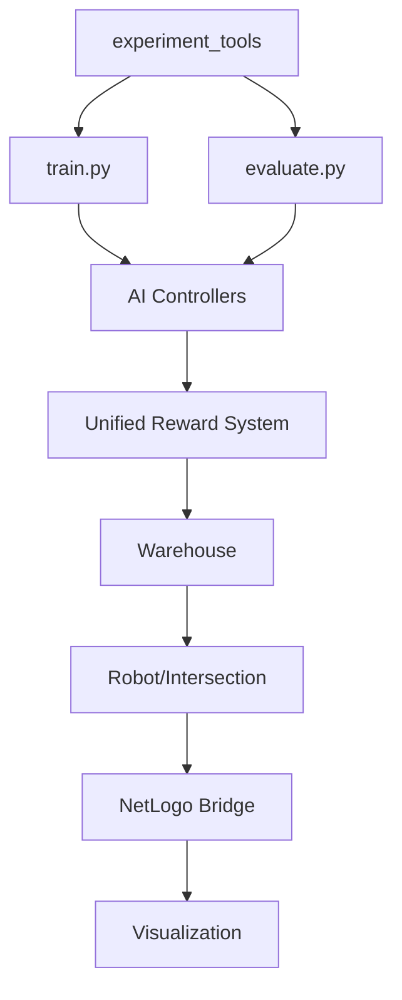

# RMFS 混合式倉儲自動化系統 - 完整專案分析報告

## 📋 專案概述

**專案名稱**：RMFS (Robotic Mobile Fulfillment System) 混合式倉儲自動化系統  
**技術架構**：Python 後端邏輯 + NetLogo 前端視覺化  
**核心技術**：深度強化學習（DQN）、神經進化（NERL）、交通控制優化  
**版本**：V7.0（支援關鍵路口權重與限速控制）

### 系統特色
- **混合架構設計**：結合 Python 的強大運算能力與 NetLogo 的視覺化優勢
- **多元控制策略**：4 種控制器（Time-based、Queue-based、DQN、NERL）
- **分散式控制**：邏輯分散（每個路口獨立決策）、實例集中（每個路口有自己的控制器實例）
- **V7.0 創新**：關鍵路口權重系統、走廊級限速控制、6 動作空間

## 🏗️ 專案架構分析

### 一、目錄結構組織

```
rmfs-kris-gpu-1/
├── ai/                     # AI控制系統核心
├── world/                  # 倉儲模擬系統
├── experiment_tools/       # 實驗管理工具
├── lib/                    # 核心函式庫
├── evaluation/             # 評估框架
├── data/                   # 輸入輸出資料
├── models/                 # 訓練模型存儲
├── result/                 # 實驗結果
├── evaluation_results/     # 評估結果
├── 最新驗證數據/           # 論文驗證資料
└── thesis/                 # 論文相關文檔
```

### 二、核心模組功能分析

#### 2.1 AI 控制系統 (`ai/` 目錄)

##### 統一獎勵系統 (`unified_reward_system.py`)
- **功能**：V7.0 增強版獎勵系統，統一 Step 和 Global 模式
- **特色**：
  - 關鍵路口權重：`[0, 6, 12, 18, 24, 30, 36, 42, 48, 54, 60]`
  - 混合式 Step 獎勵：50% 絕對值 + 50% 相對改善
  - 豐富的統計指標收集
- **重要性**：★★★★★（系統核心）

##### DQN 控制器 (`controllers/dqn_controller.py`)
- **功能**：深度 Q 學習交通控制
- **網路架構**：17→128→64→6（11,011 參數）
- **特色**：
  - 經驗回放緩衝區（容量 10000）
  - 目標網路定期更新（每 100 步）
  - Epsilon-greedy 探索（0.99995 衰減率）
- **重要性**：★★★★★

##### NERL 控制器 (`controllers/nerl_controller.py`)
- **功能**：神經進化強化學習
- **特色**：
  - 族群大小 20，菁英保留 20%
  - 錦標賽選擇（tournament size = 3）
  - 修復初始化問題，避免 100% Keep 動作
- **重要性**：★★★★★

##### 自適應標準化器 (`adaptive_normalizer.py`)
- **功能**：動態狀態標準化
- **特色**：
  - 滑動窗口統計（1000 樣本）
  - 95% 百分位數截斷
  - 特徵獨立處理
- **重要性**：★★★★☆

#### 2.2 倉儲模擬系統 (`world/` 目錄)

##### 倉庫主體 (`warehouse.py`)
- **功能**：環境總控制器
- **管理器整合**：
  - RobotManager：20 個機器人
  - IntersectionManager：66 個路口
  - OrderManager：訂單流管理
  - SpeedLimitManager：V7.0 限速控制
- **重要性**：★★★★★

##### 機器人實體 (`entities/robot.py`)
- **功能**：機器人行為與能源模型
- **物理模型**：
  - 能源消耗：E = 質量 × 加速度 × 距離
  - 再生制動：回收 30% 減速能量
  - V7.0 限速：能源消耗 ∝ 速度^1.5
- **修復 Bug**：解決直衝揀貨台問題
- **重要性**：★★★★★

##### 路口管理 (`managers/intersection_manager.py`)
- **功能**：交通控制協調
- **特色**：
  - AI 控制器整合介面
  - 訓練模式管理
  - 性能指標收集
- **重要性**：★★★★★

##### V7.0 限速系統 (`speed_limit_manager.py`)
- **功能**：走廊級限速控制
- **設計理念**：
  - 整條走廊限速，而非單一路口
  - 水平/垂直走廊獨立控制
  - 自動應用到走廊上的所有機器人
- **重要性**：★★★☆☆

#### 2.3 實驗管理工具 (`experiment_tools/` 目錄)

##### 簡潔實驗管理器 (`simple_experiment_manager.py`)
- **功能**：圖形化實驗管理
- **預設模式**：
  - 快速模式：1-2 小時
  - 標準模式：3-4 小時
  - 論文模式：6-8 小時
- **重要性**：★★★★☆

##### 工作流執行器 (`workflow_runner.py`)
- **功能**：實驗流程自動化
- **並行策略**：
  - 外層並行：多任務同時執行
  - 內層並行：NERL 評估並行
- **重要性**：★★★★☆

### 三、主要執行檔案分析

#### 3.1 核心執行檔案

| 檔案名稱 | 功能描述 | 重要性 | 使用頻率 |
|---------|---------|--------|---------|
| `train.py` | AI 模型訓練主程式 | ★★★★★ | 高 |
| `evaluate.py` | 統一評估框架 | ★★★★★ | 高 |
| `simple_experiment.py` | 簡潔實驗入口 | ★★★★☆ | 高 |
| `visualization_generator.py` | 圖表生成工具 | ★★★★☆ | 中 |
| `netlogo.py` | NetLogo 橋接 | ★★★★★ | 高 |
| `rmfs.nlogo` | NetLogo 模擬介面 | ★★★★★ | 高 |

#### 3.2 輔助與分析工具

| 檔案名稱 | 功能描述 | 類型 | 重要性 |
|---------|---------|------|--------|
| `thesis_data_analyzer.py` | 論文數據分析 | 分析工具 | ★★★☆☆ |
| `dqn_training_visualizer.py` | DQN 訓練視覺化 | 分析工具 | ★★☆☆☆ |
| `aggregate_results.py` | 結果聚合 | 數據處理 | ★★☆☆☆ |
| `validation_analyzer.py` | 驗證分析 | 分析工具 | ★★☆☆☆ |

#### 3.3 測試與臨時檔案

| 檔案名稱 | 用途 | 是否可刪除 |
|---------|------|-----------|
| `test_visualization.py` | 視覺化測試 | 可刪除 |
| `nerl_solution.py` | NERL 方案測試 | 可刪除 |
| `verify_energy.py` | 能源模型驗證 | 可保留（驗證用） |
| `diagnose_simulation.py` | 模擬診斷 | 可保留（除錯用） |
| `clean_states.py` | 狀態清理 | 可保留（維護用） |
| `encoding_handler.py` | 編碼處理 | 可刪除 |
| `direct_assign_backlog.py` | 積壓訂單測試 | 可刪除 |
| `reassign_orders.py` | 訂單重分配測試 | 可刪除 |
| `implement_decision_interval.py` | 決策間隔測試 | 可刪除 |
| `netlogo_state_patch.py` | NetLogo 狀態修補 | 臨時檔案 |
| `netlogo_parallel.py` | 並行版本測試 | 實驗性 |
| `evaluate_parallel.py` | 並行評估測試 | 實驗性 |
| `evaluate_simple.py` | 簡化評估測試 | 實驗性 |

### 四、系統架構特點

#### 4.1 分層架構設計

```
表示層（NetLogo）
    ↓
控制層（AI Controllers）
    ↓
業務層（Warehouse Management）
    ↓
數據層（State Persistence）
```

#### 4.2 模組間依賴關係



#### 4.3 資料流向

1. **訓練流程**：
   - 倉庫初始化 → 狀態收集 → AI 決策 → 獎勵計算 → 模型更新

2. **評估流程**：
   - 模型載入 → 控制器執行 → 指標收集 → 結果輸出

3. **實驗流程**：
   - 配置選擇 → 批量訓練 → 批量評估 → 結果分析 → 圖表生成

### 五、關鍵創新點

#### 5.1 V7.0 系統創新
- **關鍵路口權重**：識別並優先優化 11 個關鍵交通節點
- **限速控制系統**：動作空間從 3 擴展到 6，支援動態速度調整
- **改進 Step 獎勵**：結合絕對值與相對改善，更穩定的學習信號

#### 5.2 工程實踐創新
- **混合架構**：Python 運算 + NetLogo 視覺化的最佳組合
- **並行安全**：完善的狀態隔離和文件鎖機制
- **實驗自動化**：從訓練到分析的全流程自動化

#### 5.3 研究方法創新
- **統一獎勵系統**：Step 和 Global 模式的統一框架
- **自適應標準化**：動態調整特徵範圍
- **多維度評估**：能源、時間、完成率的綜合考量

### 六、系統優缺點分析

#### 優點
1. **模組化設計**：高內聚低耦合，易於維護擴展
2. **完整工具鏈**：從訓練到分析的完整支援
3. **豐富文檔**：詳細的 CLAUDE.md 和使用指南
4. **並行支援**：充分利用多核心資源
5. **視覺化強**：NetLogo 提供直觀的模擬觀察

#### 缺點
1. **環境依賴**：需要 NetLogo 6.2+ 和特定 Python 版本
2. **平台限制**：NetLogo 需要在 Windows 環境運行
3. **資源消耗**：大規模實驗需要較高的計算資源
4. **學習曲線**：新手需要理解混合架構的設計理念

### 七、開發建議

#### 7.1 代碼優化建議
1. 考慮將部分臨時測試檔案移至專門的 `tests/` 目錄
2. 增加單元測試覆蓋率
3. 統一錯誤處理和日誌記錄機制
4. 考慮使用配置管理框架（如 Hydra）

#### 7.2 功能擴展建議
1. 支援更多控制策略（如 PPO、SAC）
2. 增加多智能體協同控制
3. 支援動態倉庫佈局調整
4. 增加即時監控 Dashboard

#### 7.3 研究方向建議
1. 探索遷移學習在不同倉庫佈局的應用
2. 研究聯邦學習在多倉庫協同的可能
3. 引入圖神經網路處理路口關係
4. 研究能源優化與任務完成的帕累托前沿

### 八、總結

RMFS 專案是一個設計精良、實現完整的倉儲自動化研究平台。它成功地結合了深度學習、進化算法和倉儲模擬，為智慧倉儲的交通控制問題提供了創新的解決方案。專案的模組化設計、完善的工具鏈和豐富的文檔使其不僅適合學術研究，也具有實際應用的潛力。

V7.0 版本的創新（關鍵路口權重、限速控制）展現了系統的持續演進能力，而完整的實驗管理和評估框架則確保了研究結果的可重現性和可靠性。這是一個值得深入研究和持續發展的優秀專案。

---

**文檔版本**：1.0  
**分析日期**：2025-08-03  
**分析者**：Claude Code Assistant  
**專案版本**：V7.0